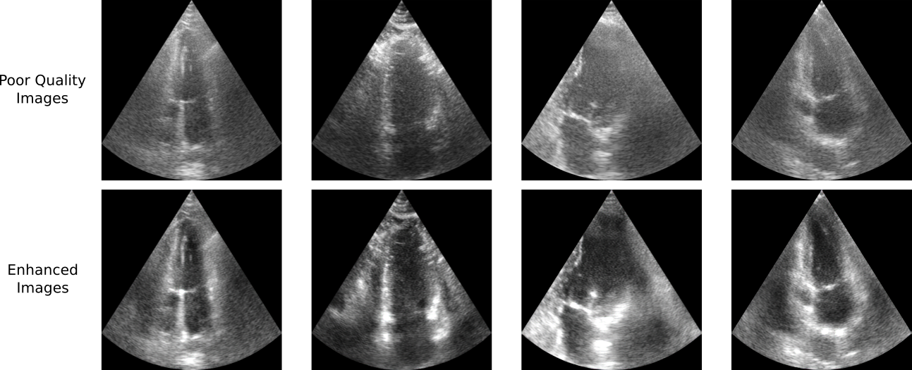

# **UltraGAN: Ultrasound Enhancement Through Adversarial Generation**

This repository provides a PyTorch implementation of UltraGAN, presented in the paper [UltraGAN: Ultrasound Enhancement Through Adversarial Generation](https://link.springer.com/chapter/10.1007/978-3-030-59520-3_13). Presented at the Simulation and Synthesis in Medical Imaging workshop [SASHIMI](http://www.sashimi.aramislab.fr/) in [MICCAI, 2020](https://www.miccai2020.org/). UltraGAN is a novel method for ultrasound enhancement that transfers quality details while preserving structural information. UltraGAN incorporates frequency loss functions and an anatomical coherence constraint to perform quality enhancement. We show improvement in image quality without sacrificing anatomical consistency.
<br/>

## Paper
[UltraGAN: Ultrasound Enhancement Through Adversarial Generation](https://link.springer.com/chapter/10.1007/978-3-030-59520-3_13) <br/>
[María Escobar](https://mc-escobar11.github.io/)<sup> 1* </sup>, [Angela Castillo](https://angelacast135.github.io/)<sup>1*</sup>, [Andrés Romero](https://afromero.co/es/) <sup>2</sup>, [Pablo Arbeláez](https://scholar.google.com.co/citations?user=k0nZO90AAAAJ&hl=en)<sup>1</sup> <br/>
<sup>*</sup>Equal contribution.<br/>
<sup>1 </sup> Center for Research and Formation in Artificial Intelligence ([CINFONIA](https://cinfonia.uniandes.edu.co/)) , Universidad de Los Andes. <br/>
<sup>2 </sup>Computer Vision Lab, ETHZ <br/>
<br/>

<p align="center"></p>


## Usage
### Cloning the repository
```bash
$ git clone https://github.com/BCV-Uniandes/UltraGAN.git
$ cd ultragan
```
### Train setup:

```bash
bash train_net.sh
```
### Test setup:

```bash
bash test_net.sh
```

## Citation
```
@inproceedings{escobar2020ultragan,
  title={UltraGAN: Ultrasound Enhancement Through Adversarial Generation},
  author={Escobar, Maria and Castillo, Angela and Romero, Andr{\'e}s and Arbel{\'a}ez, Pablo},
  booktitle={International Workshop on Simulation and Synthesis in Medical Imaging},
  pages={120--130},
  year={2020},
  organization={Springer}
}
```
## Acknowledgments
Our code borrows heavily from [CycleGAN](https://github.com/junyanz/pytorch-CycleGAN-and-pix2pix), we thank the authors for their contributions to the community. The CAMUS dataset used in training and evaluation of our method can be found [here](https://www.creatis.insa-lyon.fr/Challenge/camus/).
